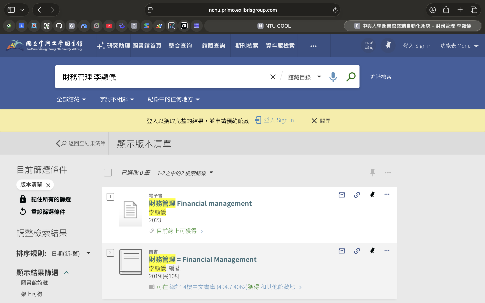
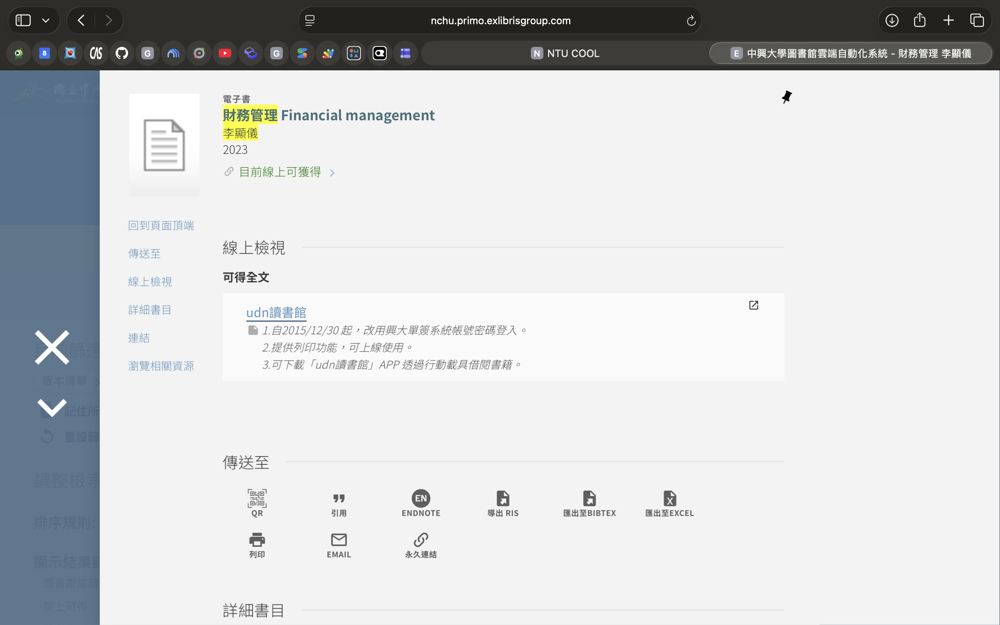
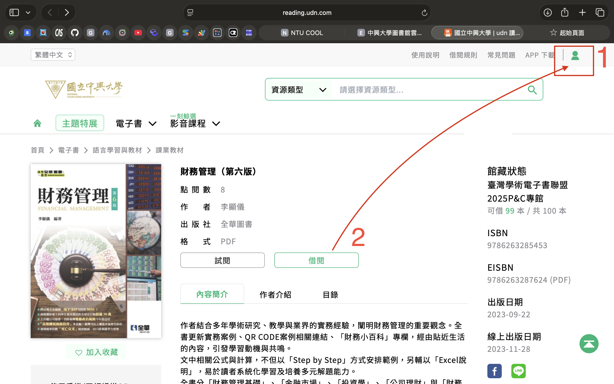
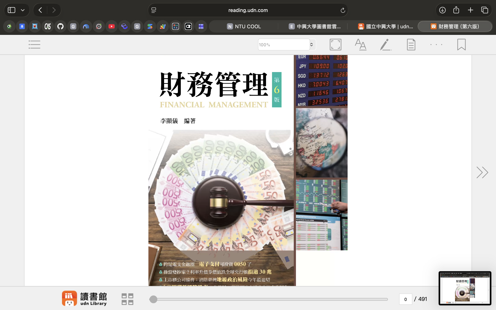

# 《財務管理（第六版）》電子書借閱與線上使用教學指南

本指南供課堂教學與修課同學參考，說明如何透過**國立中興大學圖書館**系統免費借閱及線上閱讀本課程指定參考教材《財務管理（第六版）》（李顯儀 編著）。

---

## 快速資訊摘要

- **書名**：財務管理（第六版，Financial Management）
- **作者**：李顯儀 編著
- **出版資訊**：全華圖書（2023 年版）
- **電子書平台**：udn 讀書館（臺灣學術電子書聯盟專館）
- **館藏額度**：可借 100 本（複本充裕）
- **登入方式**：中興大學單一簽入（SSO）帳號與密碼

---

## 圖文步驟教學

### 步驟一：中興大學圖書館館藏查詢

1. 前往 [國立中興大學圖書館館藏查詢系統](https://nchu.primo.exlibrisgroup.com)。
2. 在搜尋列輸入：`財務管理 李顯儀` 並進行檢索。
3. 於檢索結果中找到標註 **「電子書」** 的項目（標題為 *財務管理 Financial management*，2023 年版），點擊 **「目前線上可獲得」**。

---

### 步驟二：點擊電子書全文連結

1. 在書籍詳細資訊面板中，找到「線上檢視」區塊。
2. 點擊 **「udn讀書館」** 外部連結開啟電子書平台。
3. *系統提示備註：登入時使用興大單簽帳號密碼，亦可下載「udn讀書館」行動載具 APP 閱讀。*

---

### 步驟三：興大單簽登入並點選借閱

進入 udn 讀書館書籍頁面後：
1. **先登入**：點擊右上角 **「人像圖示」**（如紅框 1），以**中興大學單一簽入（單簽）帳號密碼**完成登入。
2. **點選借閱**：登入完成後，點選綠色按鈕 **「借閱」**（如紅框 2）。

---

### 步驟四：開啟線上閱讀器閱讀

1. 借閱成功後，點擊「線上閱讀」即可在瀏覽器開啟 udn 閱讀器。
2. 介面提供全書目錄、頁面縮放、列印及備註畫線功能，即可開始正常閱讀上課教材。

---

## 注意事項與常見問題

1. **校外連線**：若在校外網路環境操作，系統會自動導向興大單簽身分驗證頁面，登入後即可正常借閱。
2. **行動裝置使用**：手機或平板電腦可至 App Store / Google Play 下載「**udn 讀書館**」App，搜尋「國立中興大學」並以學校帳密登入，即可離線或隨身閱讀。
3. **借期與續借**：電子書到期會由系統自動歸還，不用擔心逾期罰款問題；如需繼續使用再次點選借閱即可。

---

## 🔗 圖書館館藏直達連結

- **興大圖書館直達頁面**：[點此前往中興大學圖書館《財務管理（第六版）》館藏頁面](https://nchu.primo.exlibrisgroup.com/discovery/fulldisplay?docid=alma9973925559607976&context=L&vid=886NCHU_INST:886NCHU_INST&lang=zh-tw&search_scope=MyInstitution&adaptor=Local%20Search%20Engine&isFrbr=true&tab=LibraryCatalog&query=any,contains,%E8%B2%A1%E5%8B%99%E7%AE%A1%E7%90%86%20%E6%9D%8E%E9%A1%AF%E5%84%80&sortby=date_d&facet=frbrgroupid,include,9077601334601133344&offset=0)

---

## 🤖 AI 自主揭露與製作說明 (AI Assistance Disclosure)

- 本份《財務管理（第六版）》電子書使用教學指南係由課程助教與 AI Agent 協同對話生成。
- 教學內容根據中興大學圖書館雲端查詢系統（Primo）與 udn 讀書館實際介面截圖進行步驟拆解與排版製作，供課堂教學公益參考。
